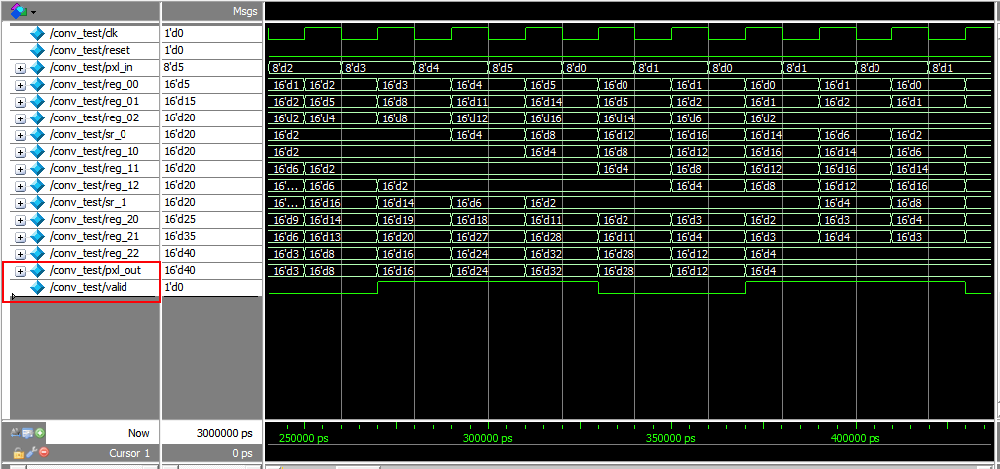

# Implementation of Sobel Filter on Verilog

The code currently computes convolution of an image with a fixed kernel to find a gradient. By extending the logic to two gradients along x and y axes, and computing the square root of the squared sums, Sobel filter can be implemented.

The convolution approach has been adopted from [this paper](http://ieeexplore.ieee.org/document/5272559/).

## Example

Assume we have a 5*5 image.

| 1    |    2 |    3 |   4 |   5 |
| ------------- |:-------------:| -----:|:-------------:| -----:|
| 0    |    1 |    0 |   1 |   0 |
| 1    |    2 |    3 |   4 |   5 |
| 0    |    1 |    0 |   1 |   0 |
| 1    |    2 |    3 |   4 |   5 |

and a 3*3 kernel

| 1    |    2 |    1 |
| ------------- |:-------------:| -----:|
| 0    |    0 |    0 |
| 1    |    2 |    1 |

The output result would be

| 7    |    12 |    16 |
| ------------- |:-------------:| -----:|
| 4    |    4  |    4  |
| 7    |    12 |    16 |

## Simulation 

The result can be verified from the screenshot here. Note that the pxl_out bits are considered only when the valid bit is `1`.

